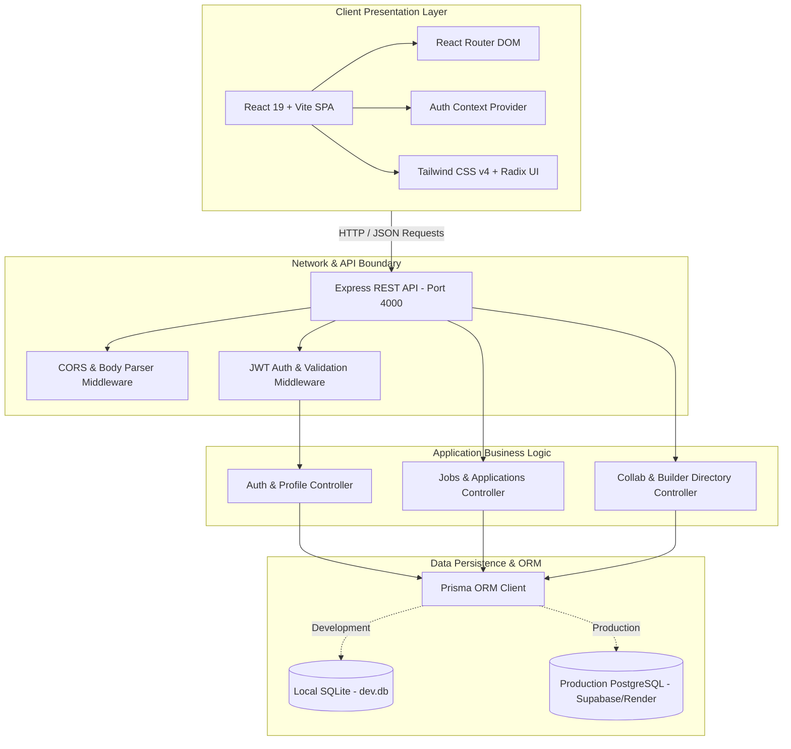
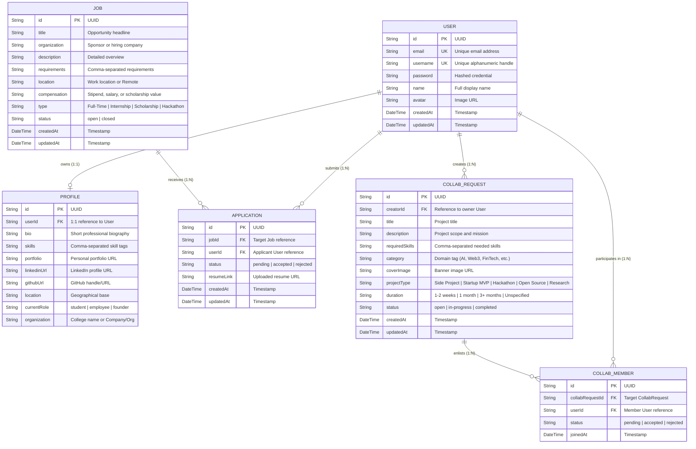
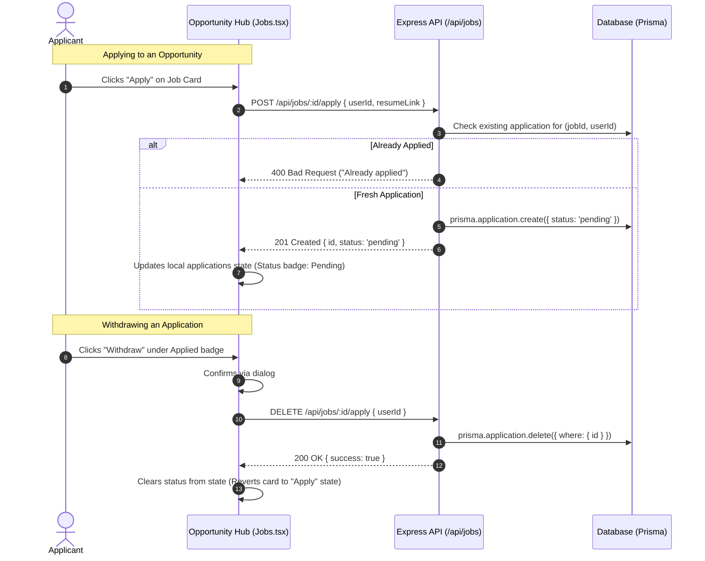
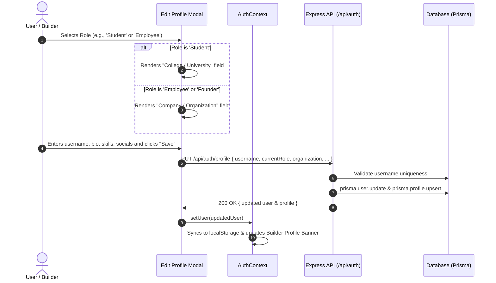

# System Architecture & Technical Specifications

This document details the high-level architecture, database entity relationships, operational data flows, and module design for the **OneShopAI Opportunity Hub** and **CollabSpace**.

---

## 1. High-Level System Architecture

OneShopAI follows a decoupled client-server architecture with a clean separation of concerns across presentation, business logic, persistence, and external services.

---

## 2. Database Entity-Relationship (ER) Diagram

The system's data model captures builders, their career profiles, job listings, application status lifecycles, and collaborative open-source projects.

---

## 3. Operational Data Flows

### 3.1 Opportunity Application & Withdrawal Lifecycle

### 3.2 Role-Adaptive Profile Customization Flow

---

## 4. Frontend Component & Layout Architecture

### 4.1 Responsive 3-Column Grid System (CollabSpace)
Both **Discover Channels** and the **Builder Directory** utilize an adaptive CSS grid layout:
- **Mobile (`< sm`)**: 1 column (`grid-cols-1`)
- **Tablet (`sm - lg`)**: 2 columns (`sm:grid-cols-2`)
- **Desktop (`lg+`)**: 3 columns (`lg:grid-cols-3`)

### 4.2 Progressive Disclosure ("View More") Pattern
To prevent visual clutter on initial page load:
1. Lists initialize with a visual limit of **6 cards**.
2. A **View More / View Less** controller dynamically expands the dataset (e.g. rendering 9+ total seeded cards).
3. Smooth transition state avoids layout thrashing.

### 4.3 Opportunity Hub Light Theme Hierarchy
The `JobDetails.tsx` view implements a dedicated light theme system:
- **Surface Elevation**: White cards (`bg-white`) bordered with slate hairline accents (`border-slate-200`) and soft shadows (`shadow-sm`).
- **Contrast Typography**: Deep slate headers (`text-slate-900`) and readable neutral body copy (`text-slate-600`).
- **Sidebar Grid**: 2-column asymmetric desktop layout (`flex-1` main content, `w-[320px]` sticky aside action panel).

---

## 5. Deployment Topology

| Layer | Recommended Hosting | Description |
| :--- | :--- | :--- |
| **Frontend** | [Vercel](https://vercel.com/) / [Netlify](https://www.netlify.com/) | Static Vite build deployed to global CDN edge with HTTP/2 and asset compression. |
| **Backend API** | [Render](https://render.com/) / [Railway](https://railway.app/) | Node.js Express service running behind a reverse proxy with TLS termination. |
| **Database** | [Supabase](https://supabase.com/) / [Neon](https://neon.tech/) | Managed PostgreSQL instance with automated backups and connection pooling. |
| **Media Assets** | [Cloudinary](https://cloudinary.com/) / [AWS S3](https://aws.amazon.com/s3/) | Scaled storage for builder avatars and project cover images. |
