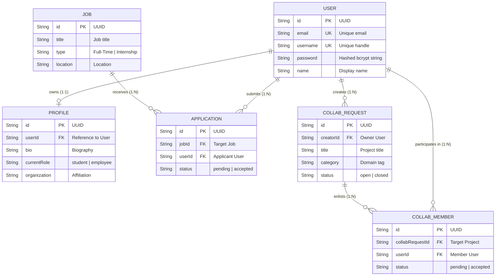

# System Architecture & Technical Specifications

This document details the high-level architecture, major modules, database design, operational data flows, and deployment strategies for the **OneShopAI Opportunity Hub** and **CollabSpace**.

---

## 1. High-Level Architecture (HLD)

OneShopAI follows a decoupled client-server architecture. This separation of concerns ensures that the presentation layer (frontend) scales independently from the business logic and persistence layers (backend and database).

```mermaid
graph TD
    subgraph Client Layer [Frontend - React SPA]
        Vite[Vite Bundler]
        ReactApp[React 19 Application]
        Router[React Router DOM]
        AuthCtx[Auth Context State]
        UI[Tailwind CSS + Radix UI]
        
        Vite --> ReactApp
        ReactApp --> Router
        ReactApp --> AuthCtx
        ReactApp --> UI
    end

    subgraph Network Layer [API Gateway]
        Express[Express.js REST API]
        CORS[CORS Middleware]
        JWT[JWT Authentication Guard]
        
        Express --> CORS
        Express --> JWT
    end

    subgraph Business Logic Layer [Backend Services]
        AuthService[Auth & Profile Module]
        JobService[Jobs & Applications Module]
        CollabService[Collab & Builder Module]
        
        JWT --> AuthService
        JWT --> JobService
        JWT --> CollabService
    end

    subgraph Persistence Layer [Database & ORM]
        Prisma[Prisma ORM Client]
        Postgres[(PostgreSQL Database)]
        
        AuthService --> Prisma
        JobService --> Prisma
        CollabService --> Prisma
        Prisma --> Postgres
    end

    Client Layer -- "HTTP/REST JSON" --> Network Layer
```

### Key Components:
- **Client Layer:** A single-page application built with React and Vite. State is managed locally via React Context, providing instantaneous UI updates.
- **Network Layer:** An Express.js server acting as the primary API gateway. It handles CORS, payload parsing, and route protection using JWT.
- **Business Logic Layer:** Modular route controllers separating Authentication, Opportunity (Job) management, and Collaboration features.
- **Persistence Layer:** Prisma ORM interacting with a PostgreSQL database, providing strict type-safety between the database schema and TypeScript models.

---

## 2. Major Modules

### Authentication & Profile Module
Manages user identity and role-based profiles.
- **Features:** Secure login/registration, JWT issuing and validation, and role-adaptive profile editing (Student vs. Employee fields).
- **Security:** Passwords are cryptographically hashed using bcrypt. Access to protected routes requires a valid Bearer token.

### Opportunity Hub Module
Handles the lifecycle of jobs, internships, and hackathons.
- **Features:** Browsing categorized opportunities, fetching detailed job descriptions, submitting applications, and withdrawing applications.
- **Data Flow:** Applications link a `User` entity to a `Job` entity, tracking statuses like `pending`, `accepted`, or `rejected`.

### Collab Space Module
Powers the community building and networking aspects.
- **Features:** Browsing builder profiles, creating collaboration projects, requesting to join teams, and managing project members.
- **Data Flow:** Project creators act as administrators for their `CollabRequest`, managing inbound `CollabMember` relationships.

---

## 3. Database Design

The relational data model captures the complex relationships between users, their professional profiles, job listings, and collaborative projects.



---

## 4. API Structure

The RESTful API is structured around entity resources. Standard HTTP methods (GET, POST, PUT, DELETE) define the operations.

- **`/api/auth`**: Endpoints for `POST /register`, `POST /login`, and `GET /me`.
- **`/api/jobs`**: Endpoints for CRUD operations on jobs and applications. Example: `POST /:id/apply` creates an application, `DELETE /:id/apply` withdraws it.
- **`/api/collab`**: Endpoints managing builder profiles (`GET /profiles`, `PUT /profile`) and collaboration channels (`POST /requests`, `POST /requests/:id/join`).

All mutating endpoints (POST, PUT, DELETE) require a valid JWT passed in the `Authorization: Bearer <token>` header.

---

## 5. Scalability & Deployment Approach

The platform is engineered to be highly scalable, utilizing managed cloud services to handle traffic spikes and database connection pooling.

### Frontend Deployment (Vercel)
- The React application is bundled by Vite into static HTML, CSS, and JS assets.
- These assets are deployed to **Vercel's Global CDN Edge Network**.
- A `vercel.json` rewrite rule routes all deep links (e.g., `/jobs/123`) to `index.html` to support client-side routing.
- Environment variables (`VITE_API_URL`) map the frontend to the production backend.

### Backend Deployment (Render)
- The Node.js Express server is containerized and deployed on **Render** as a Web Service.
- The service runs behind Render's reverse proxy, providing automatic TLS/SSL termination and DDoS protection.
- The backend is stateless (session state is managed purely via JWTs), allowing horizontal scaling across multiple instances if needed.

### Database Hosting (Supabase PostgreSQL)
- The database is hosted on **Supabase** (Managed PostgreSQL).
- To prevent connection exhaustion in serverless or heavily scaled environments, the backend connects via Supabase's **Transaction/Session Pooler** (using IPv4 compatibility on port 5432 or 6543).
- Prisma ORM manages schema migrations and ensures query optimization.

---

## 6. Authentication & Security

1. **Stateless JWT:** Sessions are managed via JSON Web Tokens. The server does not need to query the database to verify a user's logged-in status, significantly reducing database load on protected routes.
2. **Password Cryptography:** All passwords are salted and hashed using `bcrypt` before persistence.
3. **IDOR Prevention:** Insecure Direct Object Reference vulnerabilities are prevented. For instance, when a user withdraws an application (`DELETE /api/jobs/:id/apply`), the backend verifies that the token's `userId` matches the applicant.
4. **Input Validation:** Zod is used to validate incoming request bodies (e.g., ensuring emails are valid formats and strings meet length requirements) before data touches the ORM layer.
